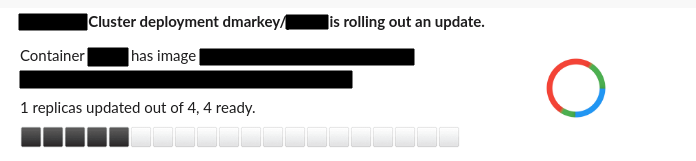
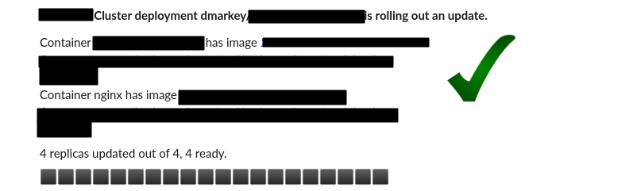
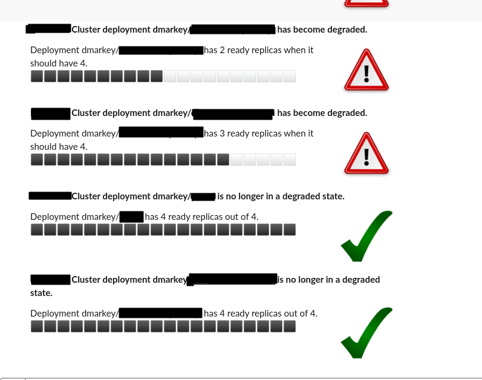

# kube-lookout
A utility to post changes to kubernetes deployments to Slack. Developed particularly for use with flux but can be used with any Kubernetes set-up. Tested with EKS 1.16 and K3S (Kubernetes 1.17)

## What does it do?

It listens to kubernetes deployment states and is interested when:

1. Any kubernetes deployment is rolling out a new version
2. If a kubernetes deployment is not healthy (Ready replicas is less than expected replicas)

It posts nice dynamic status updates for the above to slack

## For early adopters

Check deploy/* for example manifests.

The following ENV variables are used:

1. SLACK_TOKEN - A Slack Bot User OAuth Access Token - mandatory
2. SLACK_CHANNEL_ROLLOUT - Slack channel, defaults to "#general"
3. SLACK_CHANNEL_DEGRADED - Slack channel for degraded message, defaults to "#degeraded"
4. CLUSTER_NAME - this is prefixed for most messages on slack, defaults to "Kubernetes Cluster"
5. PROGRESS_IMAGE, OK_IMAGE, WARNING_IMAGE - the URLs of images used for the slack notifications. Defaults to kinda ugly creative commons images, but does the job. (dont use SVGs I learned.)

## Screenshots

## Deployment Rollout

## Degraded deployment

